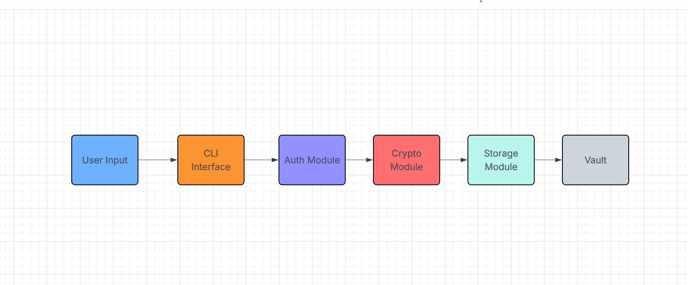

# CLI Password Manager

## 🔒 Goals
- Store and manage credentials locally via CLI
- Encrypt vault with AES-256 using `cryptography` module
- Secure vault with master password and PBKDF2 key derivation
- Add, view, search, and delete password entries via commands

## 🏗️ Architecture

## 🔧 Tech Stack
- Python 3
- cryptography
- getpass
- json
- GitHub for version control
